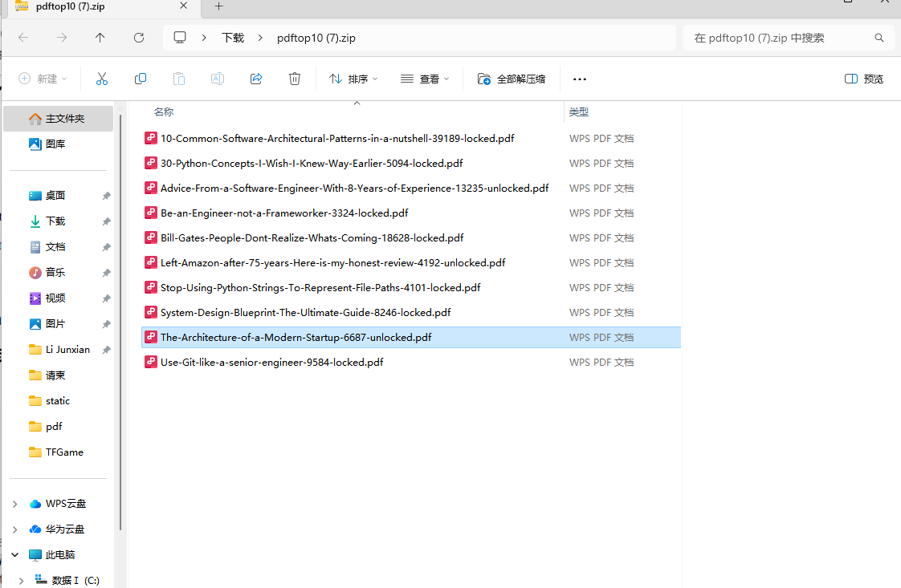

## 2024新春IT技能提升挑战：

## 解题思路
```
1、经研究：https://medium.com/，发现该网站是以文字为主，图片为辅的内容分享平台，内容以不同主题的tag进行组织。
   注册用户可通过clap（鼓掌）对内容点赞，部分内容被设置为member only，需付费查阅。
   
2、尽可能多的获取文章信息。要获取tag：software-engineering前top 10 的内容，也就是clap数最多的10条。但未能
   在medium平台找到按clap排序的方式，所以考虑先获取到题设tag下的所有文章。经探索 ，登录状态下和非登录状态下
   均可通过接口：https://medium.com/_/graphql 获取到文章唯一ID、文章标题、作者、clap、文章链接数等内容，
   但返回的数据仅有少许不同。所以我构造了本地数据库，用以记录和去重。
   
3、拿到文章数据后，再使用clap进行排序，取点赞数最高的文章链接，爬取其文章内容。

4、通过requests+beautifulSoup4取到文章具体的章节，按每个章节交给百度翻译API进行翻译，并将原文和译文均写入
   数据库和生成pdf。（百度翻译耗时较多）

5、打包pdf，创建前端UI界面，提供实时提取和实时下载的功能。

```
## 成果展示
### 获取tag:Software Engineering付费+免费top10文章


### 获取tag:Software Engineering免费top10文章


### 下载当前界面top10文章pdf


### 翻译后文档图片


## 一些思考
```
1、页面上展示tag标签下有上万条内容，但接口中传入较大的翻页字段，如1000以上时，无数据返回。没有明白是什么原因？

2、匿名请求的文章数据来自medium指定tag下的推荐文章，热度较高的文章权重应该更大，被推荐的可能更大。后面通过登录
   之后在用户界面请求的文章数据来比较，前10的差异很小，仅有一条数据有变动。

3、因为medium是采用tag的方式组织数据，所以更换tag即可抓取其它类型的文章。

```

## quickstart

#### 环境要求

```
1、windows10+

2、python3.12+

3、需要有互联网且能正常访问到https://medium.com/

**（若无法访问，可以将页面中的获取标题数量调整为0，将使用已缓存在本地的数据）**
**（使用的百度翻译接口，每月免费翻译字符数100万，密钥写死在程序里的，如果需要更改请在这里找：game/translate/baidu.py**）
```

#### 打开Windows PowerShell，拉取并进入项目根目录
```
git clone https://github.com/tfgamelijx/TFGame.git
cd TFGame
```

#### 创建一个虚拟环境并安装所需三方库
```
python -m venv .venv
.\.venv\Scripts\activate
pip install -r .\requirements.txt
```

#### 运行以下命令，按提示访问链接(一般是:http://127.0.0.1:8000/)

```
uvicorn main:app --reload
```

## 目标：

```
medium是很多it博主分享知识的收费Blog，本次挑战目标是建立一个web应用，
实现两个功能，点击"Create pdf files"按钮，
抓取https://medium.com/?tag=software-engineering的top 10 pages并逐段翻译成完整中英文对照文件，
保存成对应pdf文件。生成文件后，点击"Download"按钮
，下载生成的10个pdf文件的zip包到本地。

要求：
* 编程语言不限，第三方框架不限，操作系统不限
* github提交时间为24小时内
* 开发和网络环境自备

评价标准：
* 工程完成度
* 代码量和质量
* 用户体验
* 执行效率

工程提交：
2024年1月6日18:00前提交工程和README.md到自建github账户的私有仓库中，
登录密码统一设置为（不含引号）：“2014HappyNewYear”，发送工程链接到微信群。

评价体系：
1: 投票 70分
2: 评委 30分（有一票否决权，拒绝各种作弊，AI除外）
```
